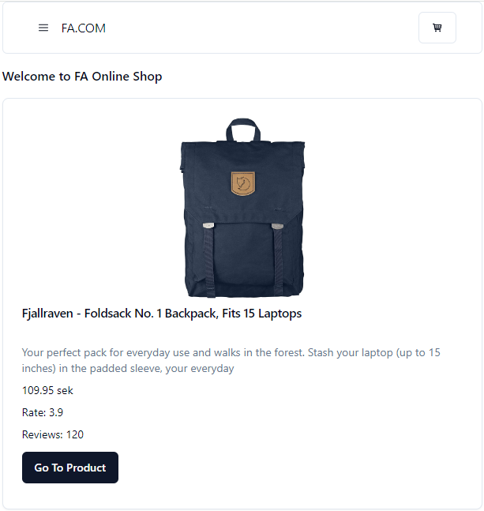

# Project Description: Shopping Cart Application

[Web demo](https://melodic-cupcake-014011.netlify.app/)

Overview:
The Shopping Cart Application aims to provide users with a seamless experience for browsing, selecting, and purchasing products. Split into two primary sections, the project entails designing the application structure and implementing core features essential for a fully functional shopping cart.

1. Designing the Application Structure:
This phase focuses on creating a robust architecture for the application. Key components include:

Cart: The central component displays selected items for purchase.
CartItem: Represents individual items in the cart, with functionalities for manipulation.
ProductList: Exhibits available products for users to select and add to their cart.
Product: Represents each product, encompassing essential details such as name, price, and image.
NavBar/Header: Displays vital information like total items in the cart and the overall price.
Route Structure:

Homepage: /
ProductList: /productList
Cart: /cart
Single Product View: /product/<id>
2. State Management:
The project employs Jotai for state management, ensuring efficient handling of the application state. Key steps include:

Completion of the Jotai tutorial to gain familiarity.
Exploration of persisted storage methods for enhanced user experience.
3. Implementing Core Features:
The core features of the Shopping Cart Application include:

Display Products: Fetch and display a list of products, featuring essential details.
Add Items to Cart: Enable users to add items to the cart, updating the cart state accordingly.
Increase/Decrease Item Quantity: Implement functionalities to adjust item quantities within the cart dynamically.
Remove Item from Cart: Allow users to remove items entirely from the cart.
Calculate Total Amount: Dynamically compute the total amount of items in the cart, updating in real-time.
Error Handling: Implement robust error handling mechanisms for data fetching and UI interactions.
4. Additional Features:

Persistent Cart: Utilize local or session storage to retain the cart state across page refreshes.
Responsive Design: Ensure the application offers an optimal user experience across various devices, prioritizing mobile responsiveness.
Data Source:

Fetch a list of products: Fake Store API - Products
<a href="https://fakestoreapi.com/products" />
CRUD operations for single products: Fake Store API - Single Product
https://fakestoreapi.com/products/<id> <a href="https://fakestoreapi.com/products/"><id></a>

Conclusion:
The Shopping Cart Application promises a user-friendly and efficient platform for online shopping, incorporating essential features and adhering to modern design principles. Through meticulous design and implementation, the project aims to deliver a seamless shopping experience for users.
